# TESTING

## 🚀 TABLE OF CONTENTS

* [RESPONSIVENESS TESTING](#responsiveness-testing)
* [BROWSER COMPABILITY TESTING](#browser-compability-testing)
* [BUGS RESOLVED AND UNRESOLVED](#bugs-resolved-and-unresolved)
* [LIGHTHOUSE REPORTS](#lighthouse-reports)
* [CODE VALIDATION](#code-validation)
* [USER STORIES TESTING](#user-stories-testing)
* [FEATURES TESTING](#features-testing)

Return back to the [README.md](README.md) file.

- - -

## RESPONSIVENESS TESTING

<details>
<summary>👇</summary>

The deployed project was tested on multiple devices for responsiveness issues.


You will observe the tag line under the logo is expanded as screen size increases, & the navbar on mobile is a cut down version of navbar on full screen. The following Bootstrap classes `table-responsive table-condensed nav-expand sticky-top (if I can get it working) d-none d-*-block` aid responsiviness & avoid need for media queries. However I have encountered a problem with table alignment which I hope can be sorted before submitting [link to table on Full Task List on > small screens]() 

|Device| Screenshot | 
|:---|:---: |
| Desktop |    |
| Laptop  |    |
| Tablet  |    |
| Mobile  |    |

</details>

- - -

## BROWSER COMPABILITY TESTING


<details>
<summary>👇</summary>

The deployed project was tested on 3 browsers to check for compatibility issues and works as expected.

|Browser | Screenshot | 
|:---:|:---: |
| Chrome |   |
| FireFox  |   |
| Edge  |   |

</details>

- - -

## BUGS RESOLVED AND UNRESOLVED 

☠️ The issues listed in the table below were indentified during the development of the project.

<details>
<summary>👇</summary>

|N.| Issue |  Action | Status | 
|:---|:--- |:--- |:--- |
|01| Table django_session don't exists | Command: python manage.py migrate sessions | Closed | 
|02 | After migration to codeanywhere, Error: pg_config executable not found | install psycopg2-binary | Closed |
|03 | After migration to codeanywhere, the app didn't run | Create virtual enviroment | Closed |
|04 | Sticky footer overlapping content | Remove class fixed-sm-bottom; add display: flex, direction: column and min-height:100vh to body and margin-top:auto to footer | Closed |
|05 | Bullets in nav list | Edit default in CSS nav ul {list-style-type: none;} | Closed |
|06 | Dropdown menu doesn't display own profile | Change the user.profile.pk to request.user.profile.pk | Closed | 
|07 | Profile_pic doesn't display correctly | Edit templates, change bootstrap classes | Closed |
|08 | Admin couldn't delete post or comment from other users | Edit the template and view adding request.user.is_superuser | Closed |
|09 | Inpunt form doesn't clean after submit | Add class form-control | Closed |
|10 | Default profile_pic doesn't display | Add boolean to templates | Closed |
|11 | Reply comment icon button doesn't work. Parent_id was not found. | Remove '' from argument in the function.  | Closed |
|12 | Default profile picture doesn't be displayed at followers_list. | Edit the template followers_list with boolean | Closed | 
|13 | ConnectionRefusedError at /accounts/password/reset/ | Google and Gitpod don't see eye-to-eye and will not send emails from a Google SMPT account. Use outlook account to send email to reset password, but got Error 500 at Heroku, then changed to a new google account, turn on the 2-Step Verification and use the App Password.| Closed |
|14 | Skip collestactic at Heroky during deployment | Run the command `python manage.py collectstatic` then deploy the project again. | Closed|
|15 | Couldn't test the application using a free version of Elephant as a database | Create a temporary database to test the application | Closed |
|16 | Post and Comment form doesn't clear after it's submitted | Call the empty form after save the content posted | Closed |
|17 | After changed the password redirects to change password page | Add a path with reverse_lazy to overwrite django allauth | Closed |
|18 | Post author couldn't delete comments in own post | Edit view and template adding if request.user == post.author. | Closed |
|19 | The table of contents on the README.md an TESTING.md doesn't work due to emojis in titles. | Remove all emojis from titles. | Closed|
|20 | NameError: name 'settings' is not defined | Remove the static from urls | Closed |
|21 | Pagination from Search and Users doesn't work correctly | Add `&amp` due to paramenters.| Closed |
| 22 | Video of the testing exceeds GitHub's file size limit and push was rejected | Delete video, `git reset --soft` was used to reset the last three commits, new commit was done with the changes, then the code was pushed to GitHub successfully | Closed | 

There are no remaining bugs.

</details>

- - -

## LIGHTHOUSE REPORTS

<details>
<summary>👇</summary>

Here are Lighthouse reports for the deployed project


|Page | Screenshot | 
|:---:|:---: |
|Home Guest |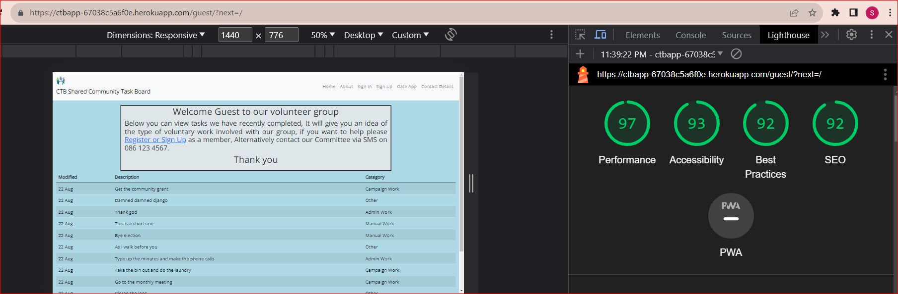 |
|Home User Logged in |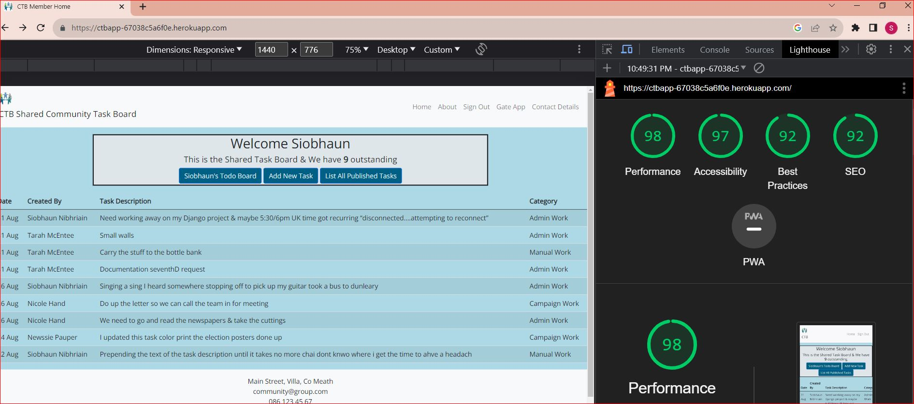 |
|Personal To Do  |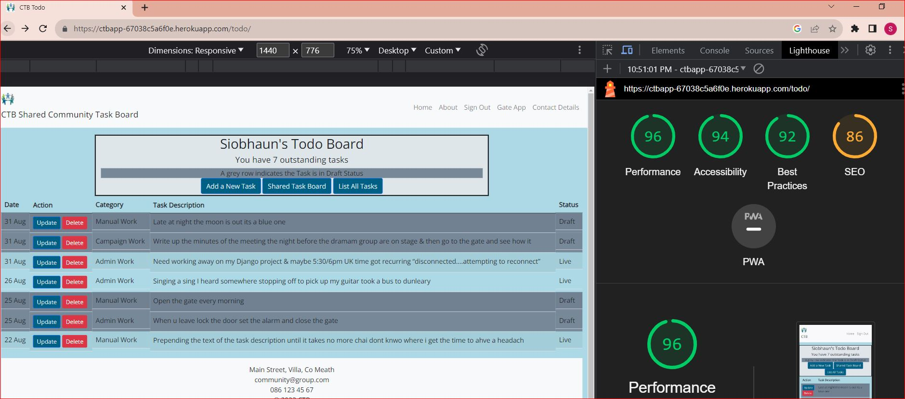 |
|Full Published  |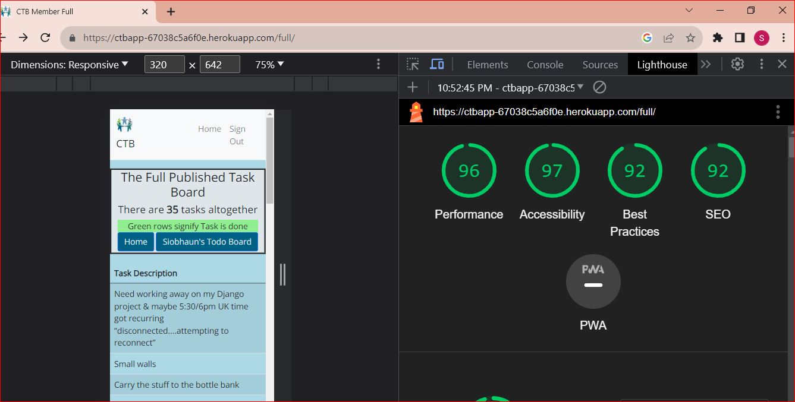 |
| New Task | 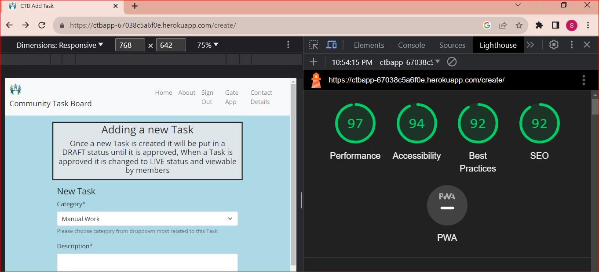 |
| Update Task | 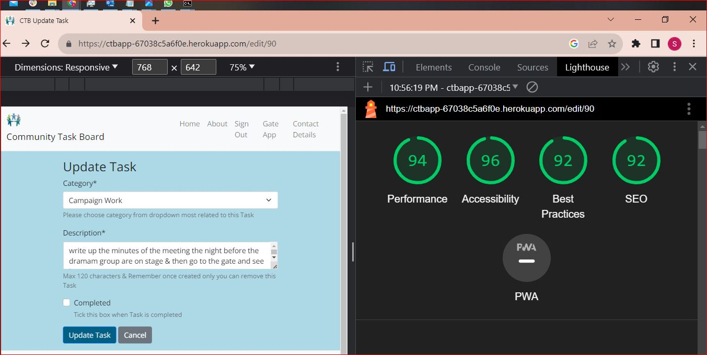 |
|About |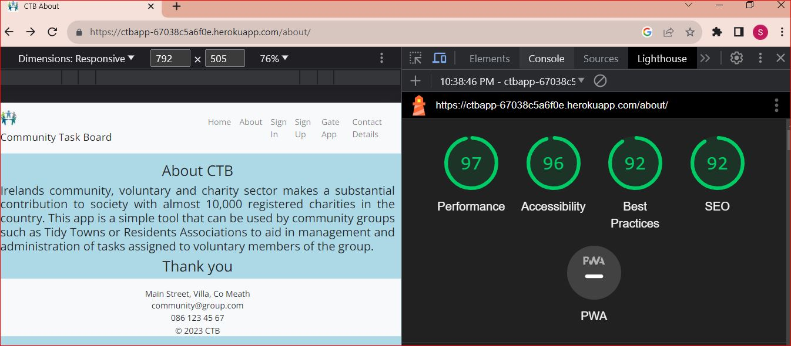 |
|Gate App  |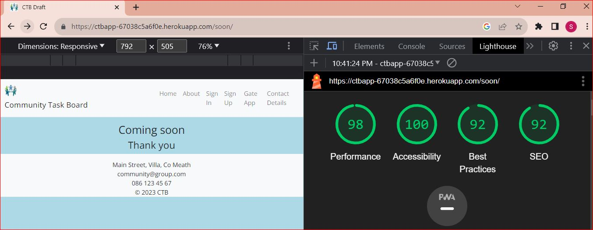 |
| Sign Up | 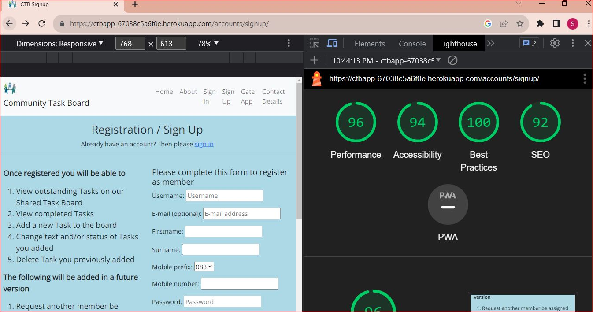|
| Sign In| 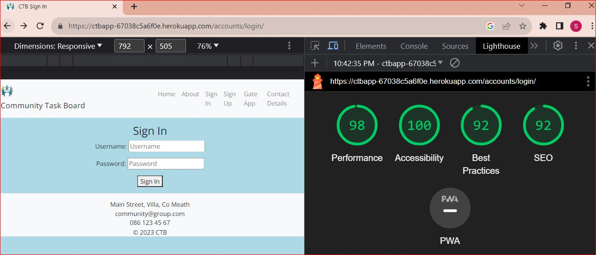 |
| Sign Out | 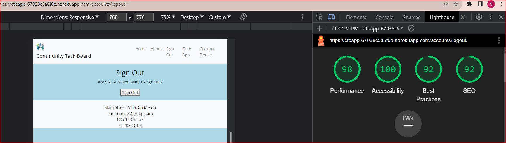 |

</details>

- - -

## CODE VALIDATION

<details>
<summary>👇</summary>

### HTML

The [HTML W3C Validator](https://validator.w3.org/) to validate all HTML files.

The result for each page are listed bellow:

|Page |Screenshot | Notes  | 
|:---:|:----------------------:|---|
| Home (Landing) |  Second test:  |First test: **Warning**: The type attribute is unnecessary for JavaScript resources. - Removed from script.|
| Sign  Up |   |
| Sign  In |   |
| Sign  Out |   | The error message was ignored, because the the `aria-controls` identifies an element in the same document whose contents are controlled by the current element.  |
| Reset Password |  Second test:   |First test: Error: Attribute mt-2 not allowed on element p at this point. - Add the missed `class=" "`.|
| Reset Password Done |   |
| Home (Main Feed - Logged in) |   |
| Following |  First test:  Second test  |"Picture uploaded" was added as an alt attribute to uploaded image by user. |
| Post Detail |   |
| Edit post |   |
| Delete post |   |
| Edit comment |   |
| Delete comment |   |
| Users | First test:  Second test:  |The escape `&amp;` was added.
| Search |  First test:  Second test: | The escape `&amp;` was added.
| Profile |  First test:  Second test:  |`<h3/>` written in the right place.|
| Profile Update |   |
| Change Password | First test:  Second test:  | Div was removed. |
| Followers |   |
| Error 403 |   |
| Error 404 |   |
| Error 500 |   |

- - - 


### CSS

The [CSS Jigsaw Validator](https://jigsaw.w3.org/css-validator/) was used to validate the CSS file.

| File | Screenshot | Notes |
| --- | --- | --- |
| style.css | 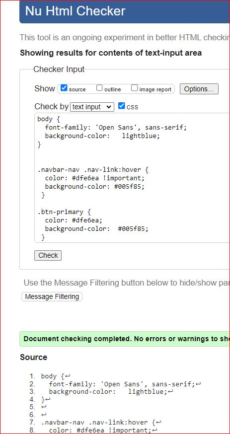 |  |

- - - 

### JAVASCRIPT

The [JShint Validator](https://jshint.com/) was used to validate the JavaScript file.

| File | Screenshot | Notes |
| --- | --- | --- |
| titbit.js |  | Unused variables: commentReply Toggle, showNotifications and removeNotifications |


- - - 


### PYTHON

The [Code Institute Python Linter](https://pep8ci.herokuapp.com)was used to validate all Python files.

#### Network project

| File | Screenshot  | Notes|
| --- | ------ |:---:|
| settings.py |   | Pass - Line too long due to AUTH_PASSWORD_VALIDATORS|
| urls.py (main) |   | Pass |
| views.py |   | Pass |


#### Home app

| File | Screenshot  | Notes|
| --- | --- | --- |
| urls.py |   | Pass |
| views.py |   | Pass |
| custom_tags.py |   | Pass |


#### Titbit app

| File | Screenshot  | Notes|
| --- | --- | --- |
| admin.py |   | Pass |
| forms.py |   | Pass |
| models.py |   | Pass |
| tests.py |    | Pass |
| urls.py |   | Pass |
| views.py |   | Pass |

</details>

- - -

## USER STORIES TESTING

<details>
<summary>👇</summary>

The implemented User Stories were tested during the development of this project and also after it was finished with the below user acceptance testing:

Check out the video with some tests by clicking [here](documentation/video/test.mp4).

There are several screenshots of the features in the [README.md](README.md) file.


### New Site Users

- - -

As a first time user of the site, I want to be able to:

*Must Have*

| User Stories |  Notes|
| --- | --- | 
| understand what the site is for and how to navigate the site, so I can decide wheter or not to sign up. | Pass |
| register for an account, so that I can create my profile and explore the website. |  Pass |
| easily navigate the site, so that I can access what I need at the click of a button. | Pass |


### **Registered Users**

- - -

As a registered user of the site, I want to be able to:

*Must Have*

| User Stories |  Notes|
| --- |  --- |
| log in to my account, so that I can access the website. |Pass |
| log out of my account, so that I can end my session | Pass |
| have my own profile, so that I can be found from my friends. |Pass |
| edit my profile, so that I can update or personalize it. | Pass |
| read the new posts, so that I can keep up to date |  Pass |
| create, edit, delete and view my posts, so that I can have control of my content | Pass |
| know the date and time a post was created, so that I can know how new or old the post is | Pass |
| post pictures, so that I can share moments or toughts | Pass |
| like or dislike other people's posts, so that I can let them know I enjoyed their posts | Pass |
| follow others users, so that I can view their posts on my following feed | Pass |
| unfollow other users, so that I can remove their post from my feed | Pass |
| be followed, so that I can know that other users read my posts  | Pass |
| view the number of likes on each post, so that I can see which is the most popular or viral  | Pass |
| add a profile picture so that I will be recognized from other users  | Pass |
| see a users list, so that I can find others users to follow them | Pass |
| search for an user, so that I can find a specific user to follow him | Pass |


*Should Have*

| User Stories |  Notes|
| --- | --- | 
| comment on other people's posts, so that I can be involved in the conversation |  Pass |
| read the comments of posts, so that I can know the thoughts from others users and follow them  | Pass |
| like other people's comments on posts, so that I can let them know I enjoyed their comment   | Pass |
| edit or delete my comments on other people's posts, so that I can edit or remove comments I no longer want published | Pass |
| delete other people's comments on my own posts, so that I can remove unwanted commments   | Pass |
| be notified when other users comment or like my posts or follow/unfollow me, so that I can check it | Pass |
| read the feed only from following users, so that I don't waste my time with unwanted posts | Pass |
| access a list from followers, so that I can find others users to follow them  | Pass |


*Could Have*

| User Stories |  Notes|
| --- | --- | 
| reply comments, so that I can interate with others users | Pass |
| reset my password, so that I can regain access to my account | Pass |
| change password, so that I feel more secure | Pass |
| add a background picture so that I will show what I like to other users | Pass |


### **Admin User**

- - -

As an administrator for the site I want to be able to:

*Must Have*

| User Stories |  Notes|
| --- | --- | 
| remove any content from any user that could be offensive, so that I can moderate the all content| Pass |
| have own profil, so that I can have user experience| Pass |

</details>

- - -

## FEATURES TESTING

<details>
<summary>👇</summary>

The features were manually tested as defensive programming during the development of this project and also after it was finished with the below user acceptance testing:


 Video recorded with testing:
  


| Page | User Action | Expected Result| Notes |
| --- | --- | --- | --- |
|  **Home Page**   |  |  | |
| Landing | Click on Logo | Redirection to Home page | Pass |
| | Click on Sign Up button  | Redirection to Sign Up page | Pass |
| | Click on Sign In button | Redirection to Sign In page | Pass |
| Logged in | Click on Logo | Redirection to Main Feed | Pass |
| **Sign Up** |  |  |  |
| | Enter valid email address | Field will only accept email address format | Pass |
| | Enter valid password (twice) | Field will only accept password format | Pass |
| | Click Sign Up button on sign up page  | Redirects user to feed and displays message | Pass |
| | Click on Sign In link | Redirection to Sign In page | Pass |
| **Sign  In** |  |  |  |
| | Enter valid email address | Field will only accept email address format or valid username | Pass |
| | Enter valid password | Field will only accept password format | Pass |
| | Click Login button on login page | Redirects user to main feed and displays message | Pass |
| | Click Forgot Password | Redirects user to password reset page | Pass |
| | Click on Sign Up link | Redirection to Sign Up page | Pass |
| **Sign  Out** |  |  |  |
| | click on dropdown menu, then sign out | Redirects to sign out page | Pass |
| | Click to confirm to sign out  | Redirects to landing page and displays message with the sign out confirmation | Pass |
| **Password Reset**|  |  |  |
| | Enter valid email address and click Reset Password button| Request confirmation | Pass |
| | Receive email with link to reset password | The link to reset the password is valid | Pass |
| | Click on the reset password link | Redirects user to change his password | Pass |
| | Attempt to use the reset password link twice | The link won't be accepted | Pass |
| **Main Feed** |  |  |  |
| | Create a post only with text as content | New post only with text is created | Pass |
| | Create a post only with picture | User is prompted to type something into the content field before sending | Pass |
| | Create a post with text and picture | New post with text and picture is created | Pass |
| | Click send on new post form without adding content | User is prompted to enter something into the field before sending | Pass |
| | Click on a post | User will be redirected to the post detail page | Pass |
| | Click on the username on a post | User will be redirected to the post author's profile | Pass |
| | Click the like button on a post | Like button will fill with colour and the like count will increase by 1, Post author receives a notification letting them know someone has liked their post | Pass  |
| | Click the like button on a post already liked by the user | Like button will become clear in the middle like count will decrease by 1 | Pass |
| | Click the dislike button on a post | Dislike button will fill with colour and the dislike count will increase by 1 | Pass  |
| | Click the dislike button on a post already liked by the user | Dislike button will become clear in the middle dislike count will decrease by 1 | Pass  |
| | Click edit icon on own post | User is redirected to post edit page | Pass   |
| | Click delete icon on own post | User is redirected to post delete confirmation page | Pass  |
| | Click on the pagination | Change the pages correctly | Pass |
| **Following Feed** |  |  |  |
| | Display only post from users who are being followed | User reads only posts of the users he follows | Pass |
| | The user is not following anyone and click on Following | Message to try follow other users | Pass |
| | Click on a post | User will be redirected to the post detail page | Pass |
| | Click on the username on a post | User will be redirected to the post author's profile | Pass |
| | Click the like button on a post | Like button will fill with colour and the like count will increase by 1, Post author receives a notification letting them know someone has liked their post | Pass  |
| | Click the like button on a post already liked by the user | Like button will become clear in the middle like count will decrease by 1 | Pass |
| | Click the dislike button on a post | Dislike button will fill with colour and the dislike count will increase by 1 | Pass  |
| | Click the dislike button on a post already liked by the user | Dislike button will become clear in the middle dislike count will decrease by 1 | Pass   |
| | Click edit icon on own post | User is redirected to post edit page | Pass  |
| | Click delete icon on own post | User is redirected to post delete confirmation page | Pass  |
| | Attempt to delete a post as admin | Admin is redirected to delete page | Pass |
| | Click on the pagination | Change the pages correctly | Pass |
| **Edit Post** | | | | 
| | Fill in post form and click submit | Original post can be edited | Pass | 
| | Click on the Back To Post button | User will be redirected to the original post | Pass | 
| **Delete Post** | | | | 
| | Click on the Delete button | Post will be permanently deleted | Pass | 
| | Click on the Back To Post button | User will be redirected to the original post | Pass | 
| **Comments on Post Detail** | | | | 
| | Comment a post | New comment is created, the post author is notificated | Pass |
| | Click send on new comment form without adding content | User is prompted to enter something into the field before sending | Pass |
| | Click the like button on a comment | Like button will fill with colour and the like count will increase by 1, Post author receives a notification letting them know someone has liked their post | Pass  |
| | Click the like button on a post already liked by the user | Like button will become clear in the middle like count will decrease by 1 | Pass |
| | Click the dislike button on a post | Dislike button will fill with colour and the dislike count will increase by 1 | Pass  |
| | Click the dislike button on a post already liked by the user | Dislike button will become clear in the middle dislike count will decrease by 1 | Pass   |
| | Click edit icon on own comment | User is redirected to comment edit page | Pass  |
| | Click delete icon on own comment | User is redirected to comment delete confirmation page | Pass  |
| | Click on the username on a comment | User will be redirected to the comment author's profile | Pass | 
| | Click on the comment icon | Open a form to reply the comment | Pass | 
| | Click edit icon on own comment | User is redirected to comment edit page | Pass | 
| | Click delete icon on own comment | User is redirected to comment delete page | Pass | 
| | Click on the pagination | Change the pages correctly | Pass |
| | Attempt to delete a comment as admin | Admin is redirected to  delete page | Pass |
| | Brute forcing the URL to delete another user's comment if not on your post | Redirects user to error page | Pass | 
| **Edit Comment** | | | | 
| | Fill in comment form and click submit | Original comment will be edited | Pass | 
| | Click on the Back To Post button | User will be redirected to the original post | Pass | 
| **Reply on Post Detail** | | | | 
| | Reply a comment | New reply is created, the comment author is notificated | Pass |
| | Click delete icon on own reply | User is redirected to  delete page | Pass | 
| | Attempt to delete a post as admin | Admin is redirected to  delete page | Pass |
| **Delete Comment or Reply** | | | | 
| | Click on the Delete button | Comment or reply will be permanently deleted | Pass | 
| | Click on the Back button | User will be redirected to the original post | Pass | 
| **Own Profile** | | | | 
| | Click on Profile button in dropdown menu | User will be redirected to their Profile page | Pass | 
| | Click on the Edit icon | User will be redirected to the edit profile page | Pass | 
| | Click on the Back To Feed button | User will be redirected to main feed | Pass | 
| | Click on followers | User will be redirected to followers list page | Pass | 
| | Click on a post | User will be redirected to the individual post page | Pass | 
| | Click edit icon on own post | User is redirected to post edit page | Pass | 
| | Click delete icon on own post | User is redirected to post delete confirmation page | Pass | 
| | Click on the pagination | Change the pages correctly | Pass |
| **Update Profile** | | | | 
| | Attempt to update the data (Name, bio, location, birthdate, profil and background pictures) | The information are saved correctly | Pass | 
| | User didn't upload pictures | Default pictures are used | Pass |
| | Click on change password | User will be redirected to change password page | Pass | 
| | Brute forcing the URL to edit another user's profile | Redirects user to error page | Pass |
| **Change Password** | | | | 
| | Attempt to change password, type the old password and the new twice | The password is changed successfully | Pass | 
| **Other Profile** | | | | 
| | Click on the follow button | User will follow current profile they're on and button will change to say unfollow, profile owner receives a notification letting them know someone has followed them and followers count will increase by 1 | Pass |  
| | Click on the unfollow button | User will unfollow current profile they're on and button will change to say follow, followers count will decrease by 1 | Pass | 
| | Click on followers | User will be redirected to followers list page | Pass |  
| | Click on the back button | User will be redirected to their feed | Pass | 
| | Click on a post | User will be redirected to the  post detail page | Pass | 
| | Click on the pagination | Change the pages correctly | Pass |
| **Followers Page** | | | | 
| | Click on user's name | User will be redirected to  user's profile | Pass |
| | Click on the pagination | Change the pages correctly | Pass |
| **Search Page** | | | | 
| | Type text into search form into nav and click the search icon | User is directed to a page with a list of  users containing his search query | Pass | If there are no users and/or posts containing the query the page will let the user know there was no results in either or both for their query |
| | Search for a non-existing user | Message  no User was found and to try again | Pass |
| | Click search icon with empty input | Redirects to users list | Pass |
| | Click on user's name | User will be redirected to  user's profile | Pass | 
| | Click on the pagination | Change the pages correctly | Pass |
| **Users Page** | | | | 
| | Click on user's name | User will be redirected to  user's profile | Pass |
| | Click on the pagination | Change the pages correctly | Pass |
| **Notifications** | | | | 
| | Click on like notification | User will be redirected to post detail from the liked post, the counter decrease by 1 | Pass |
| | Click on following notification | User will be redirected to  user's profile who started following him, the counter decrease by 1 | Pass |
| | Click on comment notification | User will be redirected to post detail from the comment, the counter decrease by 1 | Pass |
| | Click on reply notification | User will be redirected to post detail from the comment, the counter decrease by 1 | Pass |
| | Click on X | The notification will be closed, the counter decrease by 1 | Pass |
|**Error Pages** | | | | 
| | Click on Home button | User will be redirected to his feed | Pass | 
|**Footer** | | | | 
| | Click on Linkedin Icon | Redirects to LinkedIn from the creator of this application | Pass |
| | Click on GitHub Icon | Redirects to GitHub repository | Pass |
| | Click on "Lucimeri Andretta" link | Redirects to GitHub from the creator of this application | Pass |

</details>

- - -

## AUTOMATED TESTING

<details>
<summary>👇</summary>

The Django's Built-in Unit Testing Framework was used to test the application functionality on the project without errors.
To perform the test the following step was used:
- In the terminal type the command:

```bash
python3 manage.py test
```


- - -

## TEST CASE

A test case were written to proof the post feature and the delete post. A creation of a temporary database was needed.
Ran 2 tests without issues.


</details>

Return back to the [README.md](README.md) file.