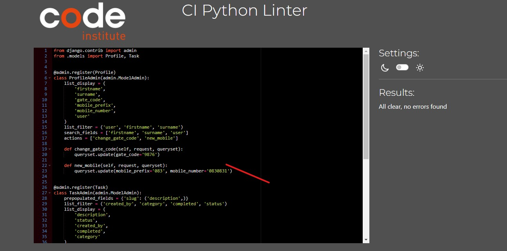

# TESTING

## 🚀 TABLE OF CONTENTS

* [RESPONSIVENESS TESTING](#responsiveness-testing)
* [BROWSER COMPABILITY TESTING](#browser-compability-testing)
* [BUGS RESOLVED AND UNRESOLVED](#bugs-resolved-and-unresolved)
* [LIGHTHOUSE REPORTS](#lighthouse-reports)
* [CODE VALIDATION](#code-validation)
* [USER STORIES TESTING](#user-story-testing)
* [FEATURES TESTING](#features-testing)

Return back to the [README.md](README.md) file.

- - -

## RESPONSIVENESS TESTING

👇

The deployed project was tested on multiple devices for responsiveness issues.

You will observe the tag line under the logo is expanded as screen size increases, & the navbar on mobile is a cut down version of navbar on full screen. The following Bootstrap classes `table-responsive table-condensed nav-expand d-none d-*-block` aid responsiviness & avoid need for media queries. However I have encountered a problem with table alignment which will not be sorted before submitting [link to table on Full Task List on > small screens]() 
It would be better UX if I could have implemented a sticky-navbar.

- - -

## BROWSER COMPABILITY TESTING

👇

The deployed project was tested on 3 browsers to check for compatibility issues and works as expected. 

|Browser | Screenshot | 
|:---:|:---: |
| Chrome |   |
| FireFox  |   |
| Edge  |   |

- - -

## BUGS RESOLVED AND UNRESOLVED 

☠️ The issues listed  below were indentified during the development of the project.

👇

#### Delete User on_delete option
I intended that if a use was deleted all associated tasks should be re-assigned to admin user but I could nto get it to work, I can try get_sentinal_user example from django doc but leaving for moment as trying to reach MVP

Error image on C:\Users\User\OneDrive\CI\PP4\snips\delete-user-SET-failed

 class Task(models.Model):
    description = models.CharField(max_length=120, unique=True, null=False, blank=False)
    slug = models.SlugField(max_length=120, unique=True)
<code>    created_by = models.ForeignKey(User, on_delete=models.SET('admin'), related_name='tasks')</code>
    created_on = models.DateTimeField(auto_now_add=True)
    modified_on = models.DateTimeField(auto_now=True)   

#### 'django.db.utils.DataError'
 This error occurred during migration after I changed the max_length of slug field to less characters than the prepopulated field (ie 50 instead of 120) & despite correcting the max_length the smaller value of 50 persisted somewhere deep in the SQL & so I was unable to clear this error. I  found it necessary to go back about 4 migrations to be able to move forward. I learned a lot about migrations.  When time allows I would recreate this issue in a test environment & spend more time investigating the cause.
 
<code> django.db.utils.DataError: value too long for type character varying(50)</code>

#### Djanjo : Related Field got invalid lookup: icontains

I got the above FieldError when testing the search bar of the taskapp Admin panel.  It was caused by fact that I had 'created_by' field included in the search fields :

<code>search_fields = ['completed', 'description', 'status', 'created_by', 'category']</code>

 This 'created_by' field has a Foreign Key and that is what is throwing this error. I removed the created_by field from the search fields and that clearerd the error.  It seems the way around this is to use double underscore on the FK for example
<code>search_fields = ['created_by__User']</code>

 but time did not allow me to test this out.

 ### User & Profile [View this BUG which has been tracked in Siobhans CTB Project](https://github.com/siobhain/ctb/issues/20)
It took me a long time to get both User & Profile models to work together, I messed up the db when using a customform for the signup, In the heel of the hunt it was that I had save functions for Profile in both the formerly and model so was getting error 'user_id already exists'. Simply removing the save in the model solved the problem but it took me over 36 hours and thoughts of giving up on the Profile altogether to get to that stage. In hindsight I don't know why I did not cop this earlier, I went down rabbit hole after hole with database inconsistency, redoing models and finally retired, resigned to fact that I'd need to start afresh & use only default user model.  The penny droppped the following day after a few hours kip & on reading [stackoverflow](https://stackoverflow.com/questions/50929110/django-cannot-assign-profile-profile-objinect-none-profile-user-must-be) & the problem was solved in a few minutes. I know this pheomena is common and its not the 1st & probably not the last time it will happen to be but just wanted to log it here as it ate much precious time at crucial stage meaning styling of my frontend will have to be completed in a hurry.  Its probably a skill that comes with experience to know best when to give up & start afresh or keep trying to solve the issue - beating the dead horse senario.

### Email
Not brave enough to pop email field in the save method so late in the PP4 road - in order to get rid of Email field on signup form. Sorry.

## Gotchas

### Two Database v's one
I intended having 2 databases, the default Django `SQLite` for development and a `Postgres` instance for production, & use environment variables coupled with `if/else` statements in `settings.py` to distinguish which db was to be used.  However, since there were a couple of false starts & with the deadline looming I decided it was a prudent option to reduce to the one database & use an ElephantSQL Postgres instance for both development and production.  I realise this would not be acceptable in the real world as best practise dictates development work would never be carried out on a production database.

### sqlite3 deployed on 1st/Empty Deployment
Since I am using only one db for both development & production I should have added `db.sqlite3` to `.gitignore` prior to 1st gitpod commit (labelled "Empty Deployment"). I subsequently updated `.gitignore`, adding `*.sqlite3` to the list (after the empty deployment commit), thinking `sqlite` would be removed from repository after the next commit but it was persisent. As I learn more about the git process it seems I need to run `git rm`` to remove  'db.sqlite3'.  This is one case of "NINTH" that I will eventually get round to but perhaps not before final submission. I'm still learning about git and its power and don't want to loose the HEAD or mess up with deadline looming.

### Move Task.created_by to admin if user instance is deleted
If/When a user/member is deleted I wanted to retain the Tasks (if any) that particular user had created, I expected the following line of code to achieve this on the Task model :

    created_by = models.ForeignKey(User, on_delete=models.SET('admin'), related_name='tasks')

 However I was not able to get it to work & due to deadline pressure had to revert to `on_delete=models.CASCADE` for MVP.

 ### Removing Change Email option for authenticated user
 
 My user model does not require email address so I tried to remove all Email references from the standard and allauth templates. According to Djamgo & allauth documentation the following 2 lines in `settings.py` should suffice :
 
    ACCOUNT_EMAIL_REQUIRED = False
    ACCOUNT_EMAIL_VERIFICATION = 'none'

However I did find some email references were still hanging around for example this `Change Email` option was appearing once a user was logged in...hmmm bit of a mystery

So on further testing/digging I found user could get into screens like this - despite me thinking email was turned off in `settings.py`

 eventually I found the offending line in a templates
  I had copied to customise & of coarse should have removed this line

    <li><a href="">Change E-mail</a></li>

& once deleted solved the issue!.  However that was AFTER I went down the rabbit hole of solving why I'd be getting these Connecion Refused type errors which I knew were occuring because I had turned off email in `settings.py` BUT WHY was user being offered these options in 1st place?? Lesson learnt - There is almost always an explanation!! 
 
![ChangeEmailError-ConnectionR to have the homepage URL render different templates/views depending on user being logged in or not (member v's guest).  I was unable to get this decorator working correctly with CBV `MemberTodoList` & `LOGIN_URL=guest`  Long story short - I'm sure you're glad - but I eventually got the decorator working with a FBV `ctb-welcome` TG. The `function object has no attribute as_view` error was on the urls.py (not the views).  I could not see the connection & checked and rechecked filenames, Class names, Views, functions urls etc but to no avail.  I need to work more with CBVs as they are very powerful and I don't fully understand yet.  It was a one liner on a [stackoverflow](https://stackoverflow.com/questions/36680358/why-show-this-error-function-object-has-no-attribute-as-view/42108345#42108345) entry that made me change tack. Even though it was 6 years old & prior to Django 1.9, it said 
- >You can't use the login_required decorator on a class like that, You need to use method_decorator

While I did not fully understand the `class like that` comment I went down the road of method_decorator but not for too long before I had the brainwave of using decorator on a FBV & sure I had a lovely little welcome FBV created at start of PP4 just to get the ball rolling & I was able to use that.  So eventually got the functefused](https://github.com/siobhain/ctb/assets/44432977/d7022284-8be0-482d-8565-e26bbc8f9ae6)

### `@login_required` Decorator on Class Based View : `function object has no attribute as_view`
I had this problem when I was tryingionality I needed just 8 hours later is all, & its probably a roundabout way of doing it but it works.

### Defensive programming on edit task ()
I tried to include defensive code in views (server side) for the the edit_task FBV (Update Task) but was unable to get it fully to work - one of many problems was the HTTP 500 server errors. Hence this is now implemented on client side ie check that logged in user is same as user who created the Task instance being edited/updated. I was able to pass the created_by variable as an extra parameter on context

|N.| Issue |  Description | Status | 
|:---|:--- |:--- |:--- |
|01| I have encountered a problem with table alignment which will not be sorted before submitting | Table misaligned on full screens  | OPEN | 
|02 | problem with sticky footer | could not get working | open | 

- - -

## LIGHTHOUSE REPORTS

👇

Here are Lighthouse reports for the deployed project

|Page | Screenshot | 
|:---:|:---: |
|Home Guest | |
|Home User Logged in | |
|Personal To Do  | |
|Full Published  | |
| New Task |  |
| Update Task |  |
|About | |
|Gate App  | |
| Sign Up | |
| Sign In|  |
| Sign Out |  |

- - -

## CODE VALIDATION

👇

### HTML

[HTML W3C Validator](https://validator.w3.org/) Screenshots

|Page |Screenshot | Notes  | 
|:---:|:----------------------:|---|
| Home Guest | |Observe on html source 4th line the Title CTB is Guest Home|
| Home Member | | ||
| Sign  Up |   |
| Sign  In |   | Validate by the page source
| Log  In |   | Validate by the address
| Sign  Out |   |
| Todo |   | Yes there is a problem here as strictly speaking one should not have a button inside an anchor tag, This button is the Delete Task action.  The original plan was to use a modal when the user requested to delete a Task, but unfortunatley I could not get the Task ID data to the modal, I then had to revert to some sort of basic warning to the user so that where I started to use the tooltip to pop up a message to the user that this action cannot be undone & afaik to get the tooltip working I neede to use the button element.|
| Full |   |
| Add Task |   |
| Update Task |   |
| 404 |   |
| Gate |   |

- - - 

### CSS

[HTML W3C Validator](https://validator.w3.org/) also used to validate the css as shown :

 |

- - - 

### JAVASCRIPT

The [JShint Validator](https://jshint.com/) was used to validate the JavaScript snippets.

- - - 

### PYTHON

The [Code Institute Python Linter](https://pep8ci.herokuapp.com) was used to validate Python files.

#### CTBPROJECT

| File | Screenshot  | Notes|
| --- | ------ |:---:|
| settings.py |   | Pass |
| urls.py (main) |   | Pass |

#### TASKAPP app

| File | Screenshot  | Notes|
| --- | --- | --- |
| admin.py |   | Pass |
| forms.py |   | Pass |
| models.py |   | Pass |
| urls.py |   | Pass |
| views.py |   | Pass |

- - -

## USER STORY TESTING

👇

I found that user stories (US) are a work in progress during the development of the project, I feel in a better position now that I am nearer the end of the project in defining US that I was at the start as having come through that process I now have a better understanding of them with clearly more to learn.  Armed with this knwoeldge I re define the US's here to aid in documenting US testing, Hence these will not follow the same USs as is in the  `@siobhain's CTB project`  [here](https://github.com/users/siobhain/projects/9) & deadline will not allow me to redo (regenerate) the US's on Github Project.

### New Site Users

- - -
As a first time user of the site, I want to be able to:

| User Stories |  Notes|
| --- | --- | 
| understand what the site is for and how to navigate the site, so I can decide whether or not to register / sign up. | Pass |
| register for an account, so that I can add Tasks and further explore the website. |  Pass |
| easily navigate the site, so that I can access what I need at the click of a button. | Pass |

### **Registered Users**

- - -

As a registered user of the site, I want to be able to:

*Must Have*

| User Stories |  Notes|
| --- |  --- |
| log in to my account, so that I can access the website. |Pass |
| log out of my account, so that I can end my session | Pass |
| view the current shared task board for the community group|  Pass |
| create, edit & delete my Tasks so that I have control of my content | Pass |
| see the date a task was created, so that I can know age of a task| Pass |
| view the full task board including completed tasks so I can see what the group has done in the past|  Pass |

*Won't Have this version*

| User Stories |  Notes|
| --- | --- | 
| change or reset password, so that user can regain access to my account | Pass |
| add a user picture so that user will be recognized in community  | Pass |
| see a users list, so that I can see contact details or picture of other members | Pass |
| add a task picture, so that I can better demonstrate work needed to be done | Pass |
| like or dislike other people's tasks, so that I can let them know I suport their task | Pass |
| view the number of likes on each task, so that I can see which is the most widely known about  | Pass |
| comment on other people's tasks, so that I can be involved in the conversation |  Pass |
| read the comments of tasks, so that I can know the thoughts from other members | Pass |

### **Admin User**

- - -

As an administrator for the site I want to be able to:

*Must Have*

| User Stories |  Notes|
| --- | --- | 
| publish and unpublish Tasks | Pass |
| Change the completed status of Tasks | Pass |
| search Tasks by user, status, date| Pass |

- - -

## FEATURES TESTING

👇

- - -

## AUTOMATED TESTING

👇

There was not automated testing implemented with this project.

- - -

Return back to the [README.md](README.md) file.